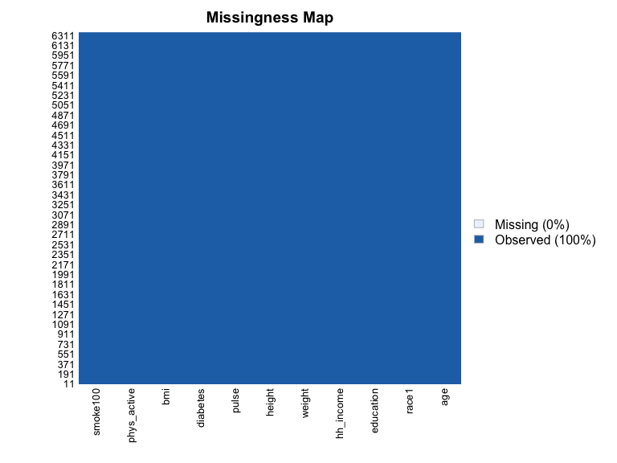
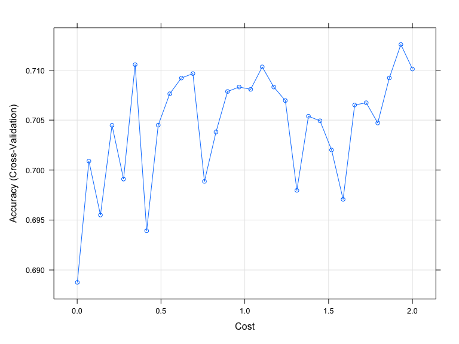
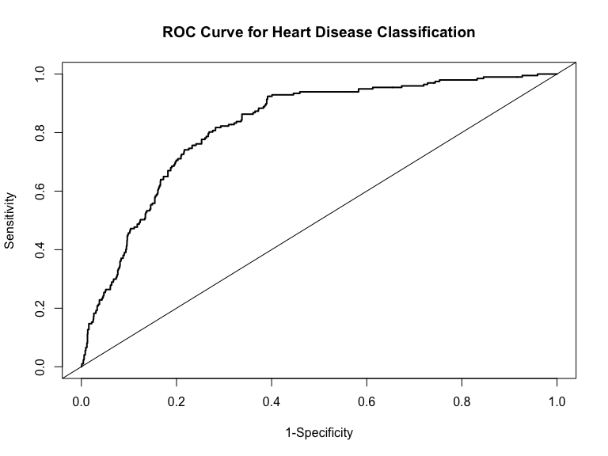

ml_hw6
================
Mohammad
2023-02-27

Comparison between Classification Trees, SVM and Logistic Regression

The posted article by Yu et al utilized NHANES data from 1999-2004 to
predict diabetes and pre-diabetes using Support Vector Machines. You
will conduct a similar analysis using data within the NHANES package in
R. For this exercise, you will try to predict Diabetes using similar
(although not all) variables. The available data is also slightly
different, so you likely won’t get the same answers.

REMINDER: Look at the frequency of your outcome variable to check for
balance

For this assignment, you will:

1.  Restrict the NHANES data to the list of 11 variables below.
    Partition the data into training and testing using a 70/30 split.

“Age”, “Race1”, “Education”, “HHIncome”, “Weight”, “Height”, “Pulse”,
“Diabetes”, “BMI”, “PhysActive”, “Smoke100”

``` r
data(NHANES)

nhanes <-
    NHANES %>% 
    as_tibble(NHANES) %>% 
    select(Age, Race1, Education, HHIncome, Weight, Height, Pulse, Diabetes, BMI, PhysActive, Smoke100) %>% 
    janitor::clean_names() %>% 
    drop_na()

 Amelia::missmap(nhanes)
```



``` r
 str(nhanes)
```

    ## tibble [6,356 × 11] (S3: tbl_df/tbl/data.frame)
    ##  $ age        : int [1:6356] 34 34 34 49 45 45 45 66 58 54 ...
    ##  $ race1      : Factor w/ 5 levels "Black","Hispanic",..: 4 4 4 4 4 4 4 4 4 4 ...
    ##  $ education  : Factor w/ 5 levels "8th Grade","9 - 11th Grade",..: 3 3 3 4 5 5 5 4 5 2 ...
    ##  $ hh_income  : Factor w/ 12 levels " 0-4999"," 5000-9999",..: 6 6 6 7 11 11 11 6 12 10 ...
    ##  $ weight     : num [1:6356] 87.4 87.4 87.4 86.7 75.7 75.7 75.7 68 78.4 74.7 ...
    ##  $ height     : num [1:6356] 165 165 165 168 167 ...
    ##  $ pulse      : int [1:6356] 70 70 70 86 62 62 62 60 62 76 ...
    ##  $ diabetes   : Factor w/ 2 levels "No","Yes": 1 1 1 1 1 1 1 1 1 1 ...
    ##  $ bmi        : num [1:6356] 32.2 32.2 32.2 30.6 27.2 ...
    ##  $ phys_active: Factor w/ 2 levels "No","Yes": 1 1 1 1 2 2 2 2 2 2 ...
    ##  $ smoke100   : Factor w/ 2 levels "No","Yes": 2 2 2 2 1 1 1 2 1 1 ...

``` r
 summary(nhanes[, "diabetes"])
```

    ##  diabetes  
    ##  No :5697  
    ##  Yes: 659

2.  Construct three prediction models to predict diabetes using the 11
    features from NHANES. You will use the following three algorithms to
    create your prediction models:

<!-- -->

1)  Classification Tree

``` r
train.index <- createDataPartition(nhanes$diabetes, p = 0.7, list = FALSE)

training <- nhanes[train.index, ]
testing <- nhanes[-train.index, ]
```

``` r
set.seed(123)

diabetestree <-
    train(diabetes~ . , data = training, method = "rpart", 
          trControl= trainControl(method = "cv", number = 10, sampling = "down"), 
           preProc = c("center", "scale"), tuneGrid = expand.grid(cp = seq(0.001, 0.3, by = 0.01)))

diabetestree$bestTune
```

    ##      cp
    ## 1 0.001

``` r
diabetestree$results
```

    ##       cp  Accuracy     Kappa AccuracySD    KappaSD
    ## 1  0.001 0.7152965 0.2356508 0.02485464 0.03263886
    ## 2  0.011 0.6939582 0.2336554 0.05839749 0.05240021
    ## 3  0.021 0.6584404 0.1978485 0.03614982 0.04259807
    ## 4  0.031 0.6440852 0.1823117 0.04783196 0.03833600
    ## 5  0.041 0.5952851 0.1609570 0.02951454 0.02077118
    ## 6  0.051 0.6011278 0.1624436 0.03993299 0.02278388
    ## 7  0.061 0.6011278 0.1624436 0.03993299 0.02278388
    ## 8  0.071 0.6011278 0.1624436 0.03993299 0.02278388
    ## 9  0.081 0.6011278 0.1624436 0.03993299 0.02278388
    ## 10 0.091 0.6011278 0.1624436 0.03993299 0.02278388
    ## 11 0.101 0.6011278 0.1624436 0.03993299 0.02278388
    ## 12 0.111 0.6011278 0.1624436 0.03993299 0.02278388
    ## 13 0.121 0.6011278 0.1624436 0.03993299 0.02278388
    ## 14 0.131 0.6011278 0.1624436 0.03993299 0.02278388
    ## 15 0.141 0.6011278 0.1624436 0.03993299 0.02278388
    ## 16 0.151 0.6011278 0.1624436 0.03993299 0.02278388
    ## 17 0.161 0.6011278 0.1624436 0.03993299 0.02278388
    ## 18 0.171 0.6011278 0.1624436 0.03993299 0.02278388
    ## 19 0.181 0.6011278 0.1624436 0.03993299 0.02278388
    ## 20 0.191 0.6011278 0.1624436 0.03993299 0.02278388
    ## 21 0.201 0.6011278 0.1624436 0.03993299 0.02278388
    ## 22 0.211 0.6011278 0.1624436 0.03993299 0.02278388
    ## 23 0.221 0.6011278 0.1624436 0.03993299 0.02278388
    ## 24 0.231 0.6011278 0.1624436 0.03993299 0.02278388
    ## 25 0.241 0.6011278 0.1624436 0.03993299 0.02278388
    ## 26 0.251 0.6011278 0.1624436 0.03993299 0.02278388
    ## 27 0.261 0.6011278 0.1624436 0.03993299 0.02278388
    ## 28 0.271 0.6011278 0.1624436 0.03993299 0.02278388
    ## 29 0.281 0.6011278 0.1624436 0.03993299 0.02278388
    ## 30 0.291 0.6011278 0.1624436 0.03993299 0.02278388

``` r
#Plot the tree
rpart.plot(diabetestree$finalModel)
```


``` r
#Variable importance
varImp(diabetestree)
```

    ## rpart variable importance
    ## 
    ##   only 20 most important variables shown (out of 34)
    ## 
    ##                           Overall
    ## age                       100.000
    ## bmi                        74.030
    ## weight                     64.513
    ## height                     36.249
    ## pulse                      29.432
    ## race1White                 28.836
    ## phys_activeYes             18.751
    ## hh_incomemore 99999        14.462
    ## smoke100Yes                11.380
    ## hh_income65000-74999        8.948
    ## hh_income15000-19999        5.169
    ## educationHigh School        5.103
    ## educationSome College       2.614
    ## hh_income75000-99999        2.236
    ## race1Mexican                2.191
    ## hh_income35000-44999        1.544
    ## educationCollege Grad       1.175
    ## `hh_income45000-54999`      0.000
    ## `hh_income75000-99999`      0.000
    ## `education9 - 11th Grade`   0.000

``` r
#Obtain accuracy and other metrics
confusionMatrix(diabetestree)
```

    ## Cross-Validated (10 fold) Confusion Matrix 
    ## 
    ## (entries are percentual average cell counts across resamples)
    ##  
    ##           Reference
    ## Prediction   No  Yes
    ##        No  63.6  2.5
    ##        Yes 26.0  7.9
    ##                             
    ##  Accuracy (average) : 0.7153

2)  Support Vector Classifier (i.e. Support Vector Machine with a linear
    classifier)

``` r
set.seed(123)

#Trainmodel using different values for cost (C)
set.seed(123)

svm <- 
    train(diabetes ~ ., data  = training, method = "svmLinear",
          trControl = trainControl(method = "cv", number = 10, sampling = "down", classProbs = T), 
          preProcess = c("center", "scale"), tuneGrid = expand.grid(C = seq(0.001, 2, length = 30)))

svm$bestTune
```

    ##           C
    ## 18 1.172828

``` r
svm$results
```

    ##             C  Accuracy     Kappa AccuracySD    KappaSD
    ## 1  0.00100000 0.6725932 0.1994310 0.01930525 0.01694138
    ## 2  0.06993103 0.7107965 0.2335305 0.02148872 0.03076259
    ## 3  0.13886207 0.7114722 0.2362990 0.02371942 0.03032815
    ## 4  0.20779310 0.7159560 0.2416135 0.02203886 0.03086260
    ## 5  0.27672414 0.7130448 0.2381057 0.03037394 0.04376779
    ## 6  0.34565517 0.7202257 0.2519657 0.02308737 0.03064341
    ## 7  0.41458621 0.7204580 0.2483398 0.02855784 0.03674153
    ## 8  0.48351724 0.7224744 0.2477286 0.02225911 0.03504347
    ## 9  0.55244828 0.7233783 0.2508046 0.02048273 0.03062435
    ## 10 0.62137931 0.7148400 0.2483814 0.02430934 0.03276658
    ## 11 0.69031034 0.7161792 0.2424804 0.02829967 0.03976054
    ## 12 0.75924138 0.7175265 0.2450713 0.02145175 0.03100681
    ## 13 0.82817241 0.7150692 0.2431362 0.01787869 0.02398132
    ## 14 0.89710345 0.7222507 0.2512728 0.02867565 0.04529453
    ## 15 0.96603448 0.7166438 0.2434897 0.02671270 0.03774612
    ## 16 1.03496552 0.7191127 0.2504438 0.02657937 0.03706518
    ## 17 1.10389655 0.7186582 0.2527797 0.02255972 0.03630660
    ## 18 1.17282759 0.7242686 0.2547874 0.03326152 0.04736298
    ## 19 1.24175862 0.7206696 0.2483459 0.01986476 0.02431055
    ## 20 1.31068966 0.7148380 0.2406154 0.02454958 0.03577312
    ## 21 1.37962069 0.7209049 0.2505576 0.02414252 0.03438223
    ## 22 1.44855172 0.7123615 0.2442457 0.02542991 0.03409961
    ## 23 1.51748276 0.7085433 0.2341166 0.02076017 0.02915209
    ## 24 1.58641379 0.7211326 0.2497896 0.01778966 0.02654145
    ## 25 1.65534483 0.7143921 0.2392831 0.02383343 0.03955923
    ## 26 1.72427586 0.7146173 0.2496823 0.01756965 0.02844888
    ## 27 1.79320690 0.7177568 0.2519365 0.02356779 0.04238970
    ## 28 1.86213793 0.7224714 0.2578624 0.02099446 0.03669973
    ## 29 1.93106897 0.7170837 0.2457517 0.02250552 0.02690719
    ## 30 2.00000000 0.7125862 0.2398617 0.01866391 0.03224249

``` r
#Visualize accuracy versus values of C
plot(svm)
```



``` r
#Obtain metrics of accuracy from training
confusionMatrix(svm)
```

    ## Cross-Validated (10 fold) Confusion Matrix 
    ## 
    ## (entries are percentual average cell counts across resamples)
    ##  
    ##           Reference
    ## Prediction   No  Yes
    ##        No  64.3  2.2
    ##        Yes 25.3  8.1
    ##                             
    ##  Accuracy (average) : 0.7243

``` r
#See information about final model
svm$finalModel
```

    ## Support Vector Machine object of class "ksvm" 
    ## 
    ## SV type: C-svc  (classification) 
    ##  parameter : cost C = 1.1728275862069 
    ## 
    ## Linear (vanilla) kernel function. 
    ## 
    ## Number of Support Vectors : 559 
    ## 
    ## Objective Function Value : -632.0229 
    ## Training error : 0.238095 
    ## Probability model included.

3)  Logistic regression.

``` r
set.seed(123) 

glm <-
    train(diabetes ~., data = training, method = "glm",
          trControl = trainControl("cv", number = 10, sampling = "down"),  family = "binomial",
          preProc = c("center", "scale"))

#Model performance
confusionMatrix(glm)
```

    ## Cross-Validated (10 fold) Confusion Matrix 
    ## 
    ## (entries are percentual average cell counts across resamples)
    ##  
    ##           Reference
    ## Prediction   No  Yes
    ##        No  64.3  2.2
    ##        Yes 25.3  8.2
    ##                             
    ##  Accuracy (average) : 0.7245

3.  You will optimize each model using cross-validation to choose
    hyperparameters in the training data and then compare performance
    across models.

4.  Select a “optimal” model and calculate final evaluation metrics in
    the test set.

``` r
#Make predictions in testset
preds <-predict(svm, testing)

#Get evaluation metrics from test set
confusionMatrix(preds, testing$diabetes, positive = "Yes")
```

    ## Confusion Matrix and Statistics
    ## 
    ##           Reference
    ## Prediction   No  Yes
    ##        No  1228   44
    ##        Yes  481  153
    ##                                           
    ##                Accuracy : 0.7246          
    ##                  95% CI : (0.7039, 0.7445)
    ##     No Information Rate : 0.8966          
    ##     P-Value [Acc > NIR] : 1               
    ##                                           
    ##                   Kappa : 0.2499          
    ##                                           
    ##  Mcnemar's Test P-Value : <2e-16          
    ##                                           
    ##             Sensitivity : 0.77665         
    ##             Specificity : 0.71855         
    ##          Pos Pred Value : 0.24132         
    ##          Neg Pred Value : 0.96541         
    ##              Prevalence : 0.10336         
    ##          Detection Rate : 0.08027         
    ##    Detection Prevalence : 0.33263         
    ##       Balanced Accuracy : 0.74760         
    ##                                           
    ##        'Positive' Class : Yes             
    ## 

``` r
#Create ROC Curve for Analysis
probs <- predict(svm, testing, type = "prob")

#Another potential evaluation: Area under the Reciver Operating Curve (AUROC)
analysis <- roc(response = testing$diabetes, predictor = probs[,2])
```

    ## Setting levels: control = No, case = Yes

    ## Setting direction: controls < cases

``` r
plot(1-analysis$specificities,analysis$sensitivities,type="l",
ylab="Sensitivity",xlab="1-Specificity",col="black",lwd=2,
main = "ROC Curve for Heart Disease Classification")
abline(a = 0, b = 1)
```



5.  List and describe at least two limitations/considerations of the
    model generated by this analysis. Limitations can be analytical or
    they can be considerations that need to be made regarding how the
    model would be applied in practice.

The data had a lot of missing data which were excluded prior to training
the model. This observations are inportant and includig them accounts
for a better represnetation of the populations of interest.
Additionally,
