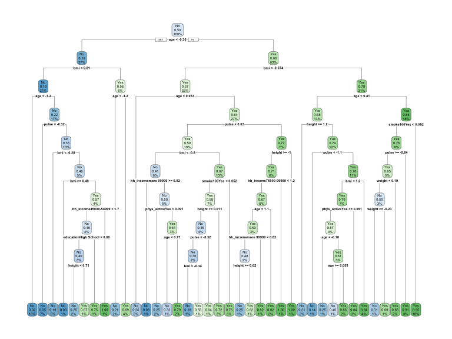

ml_hw6
================
Mohammad
2023-02-27

# Goal

To use the NHANES data to predict Diabetes using similar 11 variables.
Those are restricted to the following:

- `Age`
- `Race1`
- `Education`
- `HHIncome`
- `Weight`
- `Height`
- `Pulse`
- `Diabetes`
- `BMI`
- `PhysActive`
- `Smoke100`

## Preprocessing

``` r
set.seed(123)

data(NHANES)

#Check missingness in the data
Amelia::missmap(NHANES)
```


``` r
nhanes <-
    NHANES %>% 
    as_tibble(NHANES) %>% 
    select(Age, Race1, Education, HHIncome, Weight, Height, Pulse, Diabetes, BMI, PhysActive, Smoke100) %>% 
    janitor::clean_names() %>% 
    drop_na()

#Check data structure and balance of the outcome
str(nhanes)
```

    ## tibble [6,356 × 11] (S3: tbl_df/tbl/data.frame)
    ##  $ age        : int [1:6356] 34 34 34 49 45 45 45 66 58 54 ...
    ##  $ race1      : Factor w/ 5 levels "Black","Hispanic",..: 4 4 4 4 4 4 4 4 4 4 ...
    ##  $ education  : Factor w/ 5 levels "8th Grade","9 - 11th Grade",..: 3 3 3 4 5 5 5 4 5 2 ...
    ##  $ hh_income  : Factor w/ 12 levels " 0-4999"," 5000-9999",..: 6 6 6 7 11 11 11 6 12 10 ...
    ##  $ weight     : num [1:6356] 87.4 87.4 87.4 86.7 75.7 75.7 75.7 68 78.4 74.7 ...
    ##  $ height     : num [1:6356] 165 165 165 168 167 ...
    ##  $ pulse      : int [1:6356] 70 70 70 86 62 62 62 60 62 76 ...
    ##  $ diabetes   : Factor w/ 2 levels "No","Yes": 1 1 1 1 1 1 1 1 1 1 ...
    ##  $ bmi        : num [1:6356] 32.2 32.2 32.2 30.6 27.2 ...
    ##  $ phys_active: Factor w/ 2 levels "No","Yes": 1 1 1 1 2 2 2 2 2 2 ...
    ##  $ smoke100   : Factor w/ 2 levels "No","Yes": 2 2 2 2 1 1 1 2 1 1 ...

``` r
summary(nhanes[, "diabetes"])
```

    ##  diabetes  
    ##  No :5697  
    ##  Yes: 659

``` r
#Partition the data
train.index <- 
    nhanes$diabetes %>% 
    createDataPartition(p = 0.7, list = FALSE)

training <- 
    nhanes[train.index, ]

testing <- 
    nhanes[-train.index, ]
```

## Prediction models

To predict diabetes using the 11 features from NHANES, we will use the
following three algorithms to create the models:

### Classification Tree

Best tune for cp = 0.001. Accuracy = 0.7045. age , bmi, and weight are
the highest ranked importance variables

``` r
set.seed(123)

diabetestree <-
    train(diabetes~ . , data = training, method = "rpart", 
          trControl= trainControl(method = "cv", number = 10, sampling = "down"), 
           preProc = c("center", "scale"), tuneGrid = expand.grid(cp = seq(0.001, 0.3, by = 0.01)))

#Get best tune and results 
diabetestree$bestTune
```

    ##      cp
    ## 1 0.001

``` r
diabetestree$results
```

    ##       cp  Accuracy     Kappa AccuracySD    KappaSD
    ## 1  0.001 0.7044851 0.2225926 0.02841200 0.03349895
    ## 2  0.011 0.6692093 0.2027177 0.04085624 0.03930518
    ## 3  0.021 0.6426893 0.1774506 0.04719608 0.04582471
    ## 4  0.031 0.6269443 0.1755479 0.05187012 0.04626204
    ## 5  0.041 0.6090081 0.1640054 0.04768762 0.04897937
    ## 6  0.051 0.5793452 0.1431098 0.03648829 0.02745343
    ## 7  0.061 0.5793452 0.1431098 0.03648829 0.02745343
    ## 8  0.071 0.5793452 0.1431098 0.03648829 0.02745343
    ## 9  0.081 0.5793452 0.1431098 0.03648829 0.02745343
    ## 10 0.091 0.5793452 0.1431098 0.03648829 0.02745343
    ## 11 0.101 0.5793452 0.1431098 0.03648829 0.02745343
    ## 12 0.111 0.5793452 0.1431098 0.03648829 0.02745343
    ## 13 0.121 0.5793452 0.1431098 0.03648829 0.02745343
    ## 14 0.131 0.5793452 0.1431098 0.03648829 0.02745343
    ## 15 0.141 0.5793452 0.1431098 0.03648829 0.02745343
    ## 16 0.151 0.5793452 0.1431098 0.03648829 0.02745343
    ## 17 0.161 0.5793452 0.1431098 0.03648829 0.02745343
    ## 18 0.171 0.5793452 0.1431098 0.03648829 0.02745343
    ## 19 0.181 0.5793452 0.1431098 0.03648829 0.02745343
    ## 20 0.191 0.5793452 0.1431098 0.03648829 0.02745343
    ## 21 0.201 0.5793452 0.1431098 0.03648829 0.02745343
    ## 22 0.211 0.5793452 0.1431098 0.03648829 0.02745343
    ## 23 0.221 0.5793452 0.1431098 0.03648829 0.02745343
    ## 24 0.231 0.5793452 0.1431098 0.03648829 0.02745343
    ## 25 0.241 0.5793452 0.1431098 0.03648829 0.02745343
    ## 26 0.251 0.5793452 0.1431098 0.03648829 0.02745343
    ## 27 0.261 0.5793452 0.1431098 0.03648829 0.02745343
    ## 28 0.271 0.5793452 0.1431098 0.03648829 0.02745343
    ## 29 0.281 0.5793452 0.1431098 0.03648829 0.02745343
    ## 30 0.291 0.5793452 0.1431098 0.03648829 0.02745343

``` r
#Plot the tree
rpart.plot(diabetestree$finalModel)
```



``` r
#Variable importance
varImp(diabetestree)
```

    ## rpart variable importance
    ## 
    ##   only 20 most important variables shown (out of 35)
    ## 
    ##                         Overall
    ## age                    100.0000
    ## bmi                     69.7194
    ## weight                  49.7904
    ## height                  29.0285
    ## pulse                   28.3578
    ## educationCollege Grad   22.7297
    ## phys_activeYes          11.6649
    ## hh_incomemore 99999     11.2164
    ## race1White               4.5234
    ## smoke100Yes              4.4698
    ## hh_income45000-54999     4.0866
    ## race1Mexican             3.7162
    ## race1Hispanic            1.9055
    ## educationSome College    1.8275
    ## hh_income55000-64999     1.1010
    ## hh_income65000-74999     1.0431
    ## educationHigh School     0.8472
    ## hh_income75000-99999     0.7452
    ## hh_income20000-24999     0.5552
    ## `hh_income55000-64999`   0.0000

``` r
#Obtain accuracy and other metrics
confusionMatrix(diabetestree)
```

    ## Cross-Validated (10 fold) Confusion Matrix 
    ## 
    ## (entries are percentual average cell counts across resamples)
    ##  
    ##           Reference
    ## Prediction   No  Yes
    ##        No  62.6  2.6
    ##        Yes 27.0  7.8
    ##                             
    ##  Accuracy (average) : 0.7045

### Support Vector Classifier

Support Vector Machine with a linear classifier

The best tune for C = 1.9, accuracy = 0.7126

``` r
set.seed(123)

#Trainmodel using different values for cost (C)
svm <- 
    train(diabetes ~ ., data  = training, method = "svmLinear",
          trControl = trainControl(method = "cv", number = 10, sampling = "down"), 
          preProcess = c("center", "scale"), tuneGrid = expand.grid(C = seq(0.001, 2, length = 30)))

#Get results
svm$bestTune
```

    ##           C
    ## 29 1.931069

``` r
svm$results
```

    ##             C  Accuracy     Kappa AccuracySD    KappaSD
    ## 1  0.00100000 0.6887583 0.2070623 0.02558989 0.02698443
    ## 2  0.06993103 0.7008957 0.2355595 0.03337312 0.04468051
    ## 3  0.13886207 0.6954994 0.2266883 0.03123086 0.04431058
    ## 4  0.20779310 0.7044837 0.2376260 0.02652449 0.03992456
    ## 5  0.27672414 0.6990970 0.2283955 0.02458018 0.03718135
    ## 6  0.34565517 0.7105506 0.2418594 0.03477403 0.04902698
    ## 7  0.41458621 0.6939259 0.2225483 0.02544033 0.03236684
    ## 8  0.48351724 0.7044968 0.2377812 0.03233465 0.05017294
    ## 9  0.55244828 0.7076368 0.2373929 0.02664660 0.03807518
    ## 10 0.62137931 0.7092104 0.2408223 0.02536140 0.03986034
    ## 11 0.69031034 0.7096558 0.2457647 0.02616778 0.04077049
    ## 12 0.75924138 0.6988667 0.2253068 0.02967305 0.04591711
    ## 13 0.82817241 0.7038090 0.2357510 0.03312764 0.04433242
    ## 14 0.89710345 0.7078635 0.2368134 0.02669722 0.04559831
    ## 15 0.96603448 0.7083120 0.2371555 0.03047789 0.04163927
    ## 16 1.03496552 0.7080807 0.2437129 0.02309712 0.03750777
    ## 17 1.10389655 0.7103238 0.2382504 0.02969149 0.05097114
    ## 18 1.17282759 0.7083105 0.2398567 0.02187385 0.03569114
    ## 19 1.24175862 0.7069551 0.2338967 0.02616952 0.04393282
    ## 20 1.31068966 0.6979703 0.2305565 0.02847907 0.04096510
    ## 21 1.37962069 0.7053851 0.2371905 0.03253801 0.04564507
    ## 22 1.44855172 0.7049311 0.2386977 0.03117527 0.04663823
    ## 23 1.51748276 0.7020138 0.2337670 0.03239458 0.04487877
    ## 24 1.58641379 0.6970674 0.2341420 0.02459489 0.03814218
    ## 25 1.65534483 0.7065112 0.2318920 0.03037704 0.04460001
    ## 26 1.72427586 0.7067349 0.2415578 0.03300357 0.04457183
    ## 27 1.79320690 0.7047144 0.2331321 0.02882514 0.03916682
    ## 28 1.86213793 0.7092194 0.2407636 0.02858939 0.04047193
    ## 29 1.93106897 0.7125650 0.2467470 0.03252101 0.05436676
    ## 30 2.00000000 0.7101122 0.2434769 0.03240846 0.04978576

``` r
#Visualize accuracy versus values of C
plot(svm)
```


``` r
#Obtain metrics of accuracy from training
confusionMatrix(svm)
```

    ## Cross-Validated (10 fold) Confusion Matrix 
    ## 
    ## (entries are percentual average cell counts across resamples)
    ##  
    ##           Reference
    ## Prediction   No  Yes
    ##        No  63.0  2.1
    ##        Yes 26.7  8.3
    ##                             
    ##  Accuracy (average) : 0.7126

``` r
#See information about final model
svm$finalModel
```

    ## Support Vector Machine object of class "ksvm" 
    ## 
    ## SV type: C-svc  (classification) 
    ##  parameter : cost C = 1.93106896551724 
    ## 
    ## Linear (vanilla) kernel function. 
    ## 
    ## Number of Support Vectors : 544 
    ## 
    ## Objective Function Value : -1011.328 
    ## Training error : 0.252165

### Logistic regression.

Accuracy = 0.7148

``` r
set.seed(123) 

glm <-
    train(diabetes ~., data = training, method = "glm",
          trControl = trainControl("cv", number = 10, sampling = "down"),  family = "binomial",
          preProc = c("center", "scale"))

#Model performance
confusionMatrix(glm)
```

    ## Cross-Validated (10 fold) Confusion Matrix 
    ## 
    ## (entries are percentual average cell counts across resamples)
    ##  
    ##           Reference
    ## Prediction   No  Yes
    ##        No  63.6  2.5
    ##        Yes 26.0  7.9
    ##                             
    ##  Accuracy (average) : 0.7148

## Model selection and evaluation

The Support Vector Classifier SVC (accuracy = 0.7126) and traditional
logistic regression (accuracy = 0.7148) models performed similarly.
However, SVC offer a clear margin of separation in the data making it
better in classification of observations and more stable which makes it
the “optimal” model to predict diabetes in testing data. . Evaluating
the SVC model on the testing data yieldss high accuracy = 0.7051,
sensitivity = 0.8223, and a little lower specificity = 0.6916

``` r
set.seed(123)

#Make predictions in test set
preds <- predict(svm, testing)

#Get evaluation metrics from test set
confusionMatrix(preds, testing$diabetes, positive = "Yes")
```

    ## Confusion Matrix and Statistics
    ## 
    ##           Reference
    ## Prediction   No  Yes
    ##        No  1182   35
    ##        Yes  527  162
    ##                                           
    ##                Accuracy : 0.7051          
    ##                  95% CI : (0.6841, 0.7255)
    ##     No Information Rate : 0.8966          
    ##     P-Value [Acc > NIR] : 1               
    ##                                           
    ##                   Kappa : 0.2442          
    ##                                           
    ##  Mcnemar's Test P-Value : <2e-16          
    ##                                           
    ##             Sensitivity : 0.82234         
    ##             Specificity : 0.69163         
    ##          Pos Pred Value : 0.23512         
    ##          Neg Pred Value : 0.97124         
    ##              Prevalence : 0.10336         
    ##          Detection Rate : 0.08499         
    ##    Detection Prevalence : 0.36149         
    ##       Balanced Accuracy : 0.75698         
    ##                                           
    ##        'Positive' Class : Yes             
    ## 

## Limitations and considerations

Excluding the missing observations from the data reduces model
generalizability and real life data representation. Additionally, using
SVC models limits the interpretability. These are two analytical
limitations. Moreover, when conducting predictions using this model in
practice, close attention must be paid to social and cultural context
that may have an impact both on making and using diabetes predictions in
different communities.
